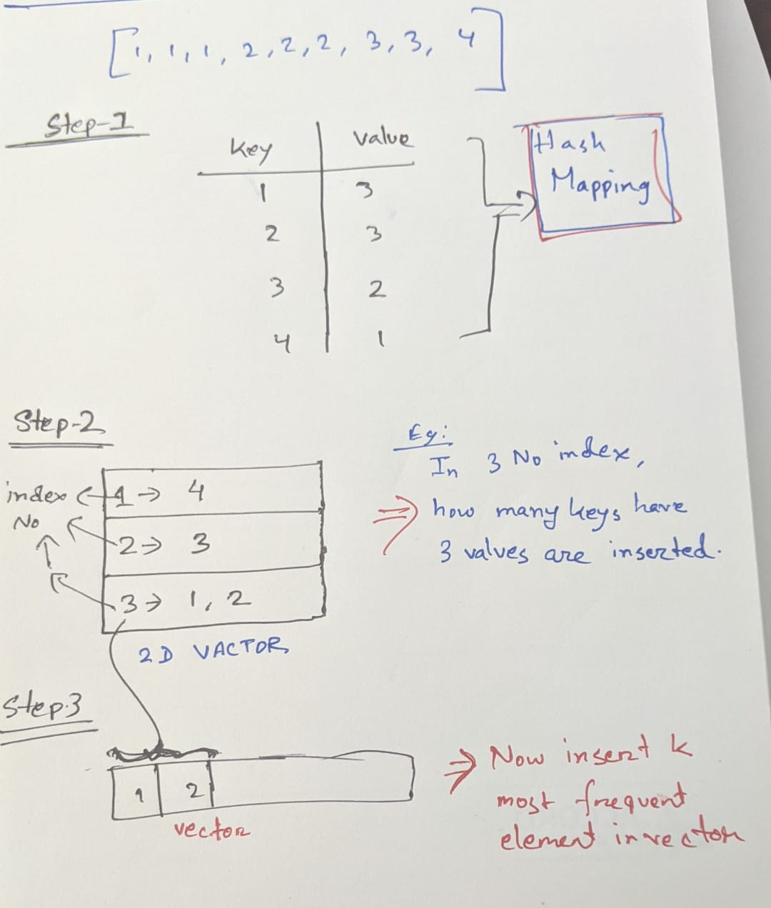

# link:

https://leetcode.com/problems/top-k-frequent-elements/



```c++

/*
    Normal approach:

        Time complexity:O(nlog n)
        Space:O(n+k)
*/
#include <iostream>
#include <bits/stdc++.h>
using namespace std;
#define fast()                    \
    ios_base::sync_with_stdio(0); \
    cin.tie(0);                   \
    cout.tie(0);
#define ll long long int
using vi = vector<int>;
using vll = vector<ll>;
#define pb push_back;
#define fo(i, a, b) for (ll i = (a); i < (b); i++)
#define w(x)  \
    ll x;     \
    cin >> x; \
    while (x--)

#define b() begin()
#define e() end()
#define cY cout << "YES\n"
#define cN cout << "NO\n"
#define cy cout << "Yes\n"
#define cn cout << "No\n"

bool comp(pair<int, int> abc, pair<int, int> cd)
{

    return abc.second > cd.second;
}
vector<int> topKFrequent(vector<int> nums, int k)
{
    unordered_map<int, int> abc;
    for (int i = 0; i < nums.size(); i++)
    {
        abc[nums[i]]++;
    }

    vector<pair<int, int>> ans;
    for (auto &i : abc)
        ans.push_back({i.first, i.second});

    sort(ans.begin(), ans.end(), comp);

    vector<int> ans2;
    for (int i = 0; i < k; i++)
    {
        ans2.push_back(ans[i].first);
    }

    return ans2;
}

int main()
{
    ll a;
    cin >> a;
    vi abc(a);
    for (int i = 0; i < a; i++)
    {
        cin >> abc[i];
    }
    ll k;
    cin >> k;
    vi cd = topKFrequent(abc, k);
    cout << cd[0] << " " << cd[1] << endl;
    return 0;
}

/*
    Better approach:
    Time complexity: O(n)
    Space complexity: O(n)
*/

class Solution
{

public:
    vector<int> topKFrequent(vector<int> nums, int k)
    {
        unordered_map<int, int> abc;
        for (int i = 0; i < nums.size(); i++)
        {
            abc[nums[i]]++;
        }

        vector<vector<int>> ans(nums.size() + 6);
        for (auto &i : abc)
            ans[i.second].push_back(i.first);

        vector<int> ans2;
        for (int i = nums.size(); i >= 0; i--)
        {
            if (ans2.size() >= k)
                break;
            if (!ans[i].empty())
                ans2.insert(ans2.end(), ans[i].begin(), ans[i].end());
        }

        return ans2;
    }
};
```
