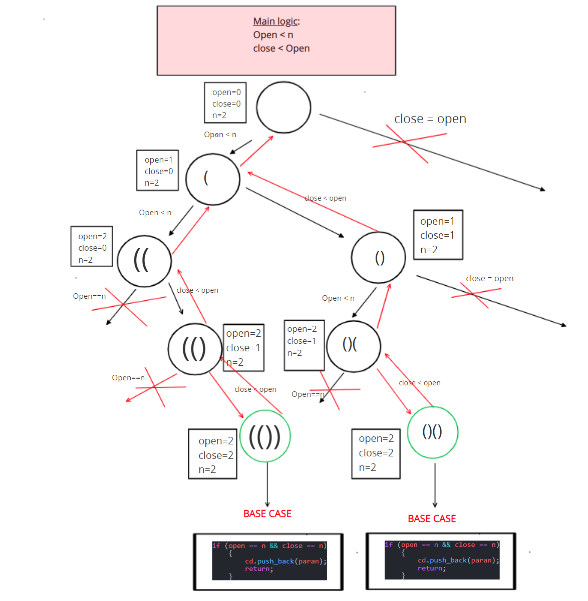

## LC22. Generate Parentheses
link: https://leetcode.com/problems/generate-parentheses/

- We can solve this problem using recursion.
```C++
#include <iostream>
#include <bits/stdc++.h>
using namespace std;
#define fast()                    \
    ios_base::sync_with_stdio(0); \
    cin.tie(0);                   \
    cout.tie(0);
#define ll long long int
using vi = vector<int>;
using vll = vector<ll>;
#define pb push_back;
#define fo(i, a, b) for (ll i = (a); i < (b); i++)
#define w(x)  \
    ll x;     \
    cin >> x; \
    while (x--)

#define b() begin()
#define e() end()
#define cY cout << "YES\n"
#define cN cout << "NO\n"
#define cy cout << "Yes\n"
#define cn cout << "No\n"
vector<string> cd;
void Generate_Parentheses(vector<string> &cd, ll open, ll close, string paran, ll n)
{
    if (open == n && close == n)
    {
        cd.push_back(paran);
        return;
    }
    //This base case also will work

    // if (paran.size()==2*n)
    // {
    //     cd.push_back(paran);
    //     return;
    // }
    if (open < n)
    {
        Generate_Parentheses(cd, open + 1, close, paran + "(", n);
    }
    if (close < open)
    {
        Generate_Parentheses(cd, open, close + 1, paran + ")", n);
    }
}
int main()
{
    ll a;
    cin >> a;
    Generate_Parentheses(cd, 0, 0, "", a);
    for (auto &i : cd)
    {
        cout << i << endl;
    }
    return 0;
}
```

## Recursion Tree:
