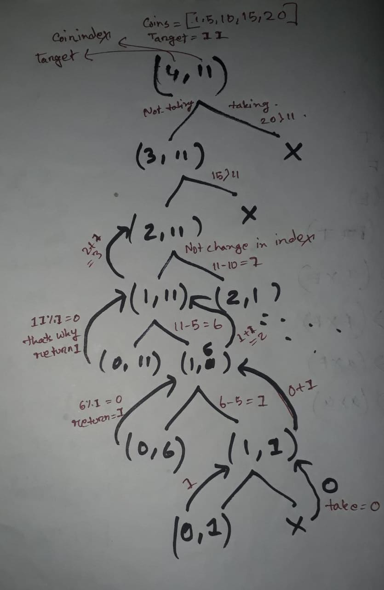

# UVA-357 - Let Me Count The Ways
Problem Link: https://onlinejudge.org/index.php?option=onlinejudge&Itemid=8&page=show_problem&problem=293

## Problem Statement briefly in Bangla:
    প্রশ্নে   ১ ,৫,১০,২৫,৫০ মূল্যের ৫ টি কয়েন দেওয়া আছ। 
    একটি এমাউন্ট বলে দেওয়া থাকবে এবং কয়েন গুলো ব্যাবহার করে এমাউন্ট টি কত ভাবে পাওয়া যায় বের করতে  হবে। 

### Input:
    17
    11
    4
### Output:
    There are 6 ways to produce 17 cents change.
    There are 4 ways to produce 11 cents change.
    There is only 1 way to produce 4 cents change.

> We can solve this problem in two approaches.
## Approach 1:
---
1. যখনই how many ways / total number of ways বের করতে বলবে base case  থেকে  ১(কন্ডিশন মিললে  ) অথবা ০( কন্ডিশন না মিললে ) রিটার্ন হবে। 
2. Taking and non taking approach apply করা হবে। taking and Not taking এর  জোগফল রিটার্ন  হব। 
3. taking এর কলিং এর সময় কয়েন ইনডেক্স  change হবে ন।  কারণ সব ধরণের পসিবিলিটি চেক করতে হবে। 


## Code in c++:
```C++
#include <iostream>
#include<bits/stdc++.h>
using namespace std;
#define fast() ios_base::sync_with_stdio(0);cin.tie(0);cout.tie(0);
#define ll long long int
using vi = vector <int>;
using vll = vector <ll>;
#define pb push_back;
#define fo(i,a,b) for(ll i=(a);i<(b);i++)
#define w(x)            ll x; cin>>x; while(x--)

#define b() begin()
#define e() end()
#define cY cout<<"YES\n"
#define cN cout<<"NO\n"
#define cy cout<<"Yes\n"
#define cn cout<<"No\n"
ll coin[5]={1,5,10,25,50};
ll given_taka;
ll dp[5][300005];
ll solve(ll cur_coin,ll cur_taka){
    
     if(cur_coin==0){
        
        return cur_taka % coin[0] == 0;
        // cur_taka কে অবশ্যই ১ম  কয়েনটি দ্বারা নিঃশেষে বিভাজ্য হতে হবে। তবেই ১ম কয়েন দিয়ে cur_taka বানানো যাব। 

    }
    if( cur_taka == 0 ) return 1;

    if( dp[cur_coin][cur_taka] != -1 )return dp[cur_coin][cur_taka];

    ll not_take = solve( cur_coin-1 , cur_taka );
    ll take=0;
    if( coin[cur_coin] <= cur_taka )
        take = solve( cur_coin , cur_taka - coin[cur_coin] );
    //কয়েন ইনডেক্স এর কোন চেইঞ্জ হবে না। 
    return dp[cur_coin][cur_taka] = not_take+take;
}
int main()
{
    memset(dp,-1,sizeof(dp));
    
    while ( cin >> given_taka ) {
        // if(given_taka==0) break;
        ll y = solve ( 4, given_taka );
        if ( y == 1 ) cout<<"There is only 1 way to produce "<<given_taka<<" cents change.\n";
        else cout<<"There are "<<y<<" ways to produce "<<given_taka<<" cents change.\n";
    }

    return 0;
}
```
## Tree:


## Time complexity:
    Here also time complexity will be the size of the dp array.
    কিন্তু উল্লেক্ষ যে এখানে dp array শুধুমাত্র একবার fill up হবে।  
    কারণ প্রত্যেকটা ইনপুট এর জন্য coin same  থাকতেসে। 
    তাই state গুলো একই থাকছে। এর জন্য প্রত্যেক input  এ অমরা dp array  clear  করছি না। 
    তাই সম্ভাব্য টাইম কমপ্লেক্সিটি হবে :
    loop in  main function + size of dp array. 

## Approach 2:
    এখানে আমরা লুপ এর মাধ্যমে কাজ করবো। 

## c++ code
```C++ 
#include <iostream>
#include<bits/stdc++.h>
using namespace std;
#define fast() ios_base::sync_with_stdio(0);cin.tie(0);cout.tie(0);
#define ll long long int
using vi = vector <int>;
using vll = vector <ll>;
#define pb push_back;
#define fo(i,a,b) for(ll i=(a);i<(b);i++)
#define w(x)            ll x; cin>>x; while(x--)

#define b() begin()
#define e() end()
#define cY cout<<"YES\n"
#define cN cout<<"NO\n"
#define cy cout<<"Yes\n"
#define cn cout<<"No\n"
ll coin[5]={1,5,10,25,50};
ll given_taka;
ll dp[5][300005];
ll solve(ll cur_coin,ll cur_taka){
    if(cur_coin==5 || cur_taka<=0){
        return (cur_taka==0);
    }
   
    if(dp[cur_coin][cur_taka]!=-1)return dp[cur_coin][cur_taka];
    ll ret=0;
    for( ll i=0 ; i<=cur_taka ; i++ ){
        if( cur_taka - ( i * coin[cur_coin] ) >= 0 )
            ret += solve( cur_coin+1 , cur_taka - ( i*coin[cur_coin] ) );
        else break;
    }
    return dp[cur_coin][cur_taka]=ret;
    
}
int main()
{
    memset(dp,-1,sizeof(dp));
    
    while ( cin >> given_taka ) {
        
        ll y = solve ( 0, given_taka );
        
        if ( y == 1 ) cout<<"There is only 1 way to produce "<<given_taka<<" cents change.\n";
        else cout<<"There are "<<y<<" ways to produce "<<given_taka<<" cents change.\n";
    }

    return 0;
}
```
