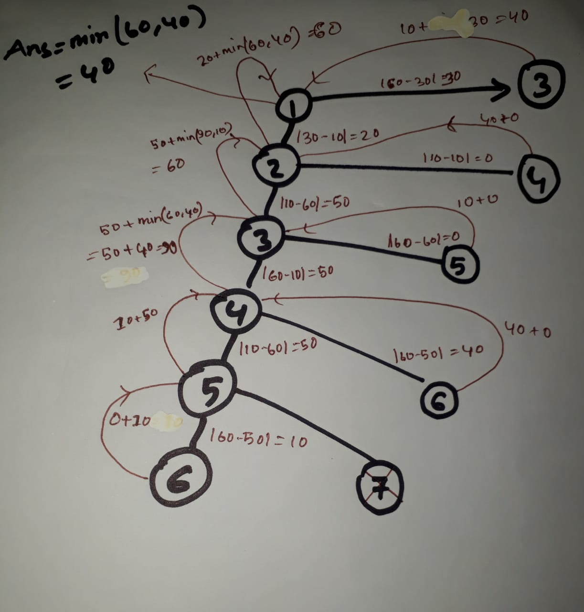

# A - Frog 1
[ ] problem Link:  https://atcoder.jp/contests/dp/tasks/dp_a
> This is a good dp problem for beginner.

## Problem Statement briefly in Bangla:
    এই প্রব্লেমে N টি পাথরের  উচ্চতা দেওয়া আছে।  
    একটি ব্যাঙ ১ম পাথরের ওপর বসে আছে।  সে ১ম পাথর থেকে ২য় পাথরে অথবা ৩য় পাথরে লাফ দিতে পারবে।  একই ভাবে ২য় থেকে ৩য় অথবা ৪র্থ পাথরে লাফ দিতে পারব।  
    * ১ম পাথর থেকে ২য় পাথরে লাফ দিতে তার খরচ হবে 
        ।২য় পাথরের উচ্চতা  - ১ম পাথরের উচ্চতা  । 
    * ১ম পাথর থেকে 3য় পাথরে লাফ দিতে খরচ হবে 
        । 3য় পাথরের উচ্চতা  - ১ম   পাথরের উচ্চতা । 

    ব্যাঙ টি ১ম থেকে লাস্ট পাথরে যেতে মিনিমাম কত খরচ হবে? 

## Input
    6
    30 10 60 10 60 50\
## Output
    40
__Description:__  
If we follow the path 1 → 3 → 5 → 6, the total cost incurred would be ∣30−60∣+∣60−60∣+∣60−50∣=40.

## Recursion Tree For This Input:


# Code In c++:
```c++
#include <iostream>
#include<bits/stdc++.h>
using namespace std;
#define fast() ios_base::sync_with_stdio(0);cin.tie(0);cout.tie(0);
#define ll long long int
using vi = vector <int>;
using vll = vector <ll>;
#define pb push_back;
#define fo(i,a,b) for(ll i=(a);i<(b);i++)
#define w(x)            ll x; cin>>x; while(x--)

#define b() begin()
#define e() end()
#define cY cout<<"YES\n"
#define cN cout<<"NO\n"
#define cy cout<<"Yes\n"
#define cn cout<<"No\n"
ll a;
vll abc(100005);
ll dp[100005];
ll min_cost_of_frog(ll i){
    if(i==a) return 0;
    ll call1=INT32_MAX;ll call2=INT32_MAX;
    if(dp[i]!=-1) return dp[i];
    if(i+1<=a)call1=abs(abc[i]-abc[i+1])+min_cost_of_frog(i+1);
    if(i+2<=a)call2=abs(abc[i]-abc[i+2])+min_cost_of_frog(i+2);
    return dp[i]=min(call1,call2);
}
int main()
{
 
    cin>>a;
    memset(dp,-1,sizeof(dp));
    fo(i,1,a+1) cin>>abc[i];
    //cout<<abc[a]<<endl;
    cout<<min_cost_of_frog(1)<<endl;
    return 0;
}
```
## Time Complexity:
---
    Time complexity will be equal to the size of the array.
    Because we are just filling the array.

