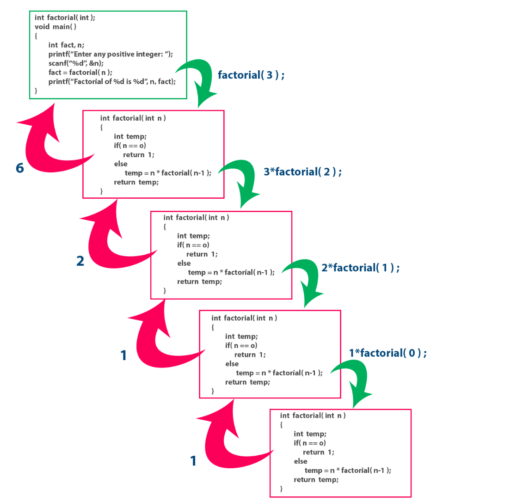
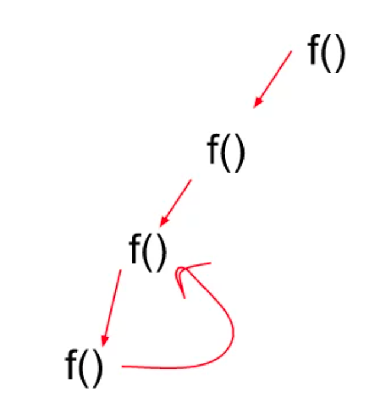
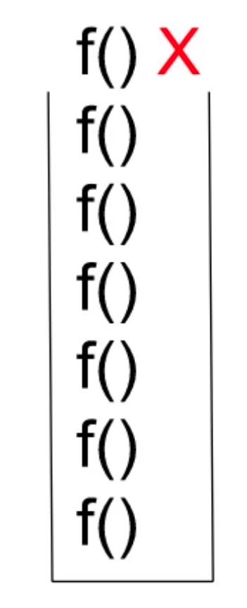

## Recursion Easy Definition :

- A function calls itself indefinitely until a specified condition is fulfilled.This specific condition is called **BASE CASE**.

- 

## Base Case:

- It is the condition that is written in a recursive function.
- Without proper base case Function will run infinitely.
- After encountering the base condition, the function terminates and returns back to its parent function simultaneously.
- In previous picture `if(n==0) return 1;` was base case.

### Recursive Tree:

- A recursive tree is basically a representative form of recursion
- We can understand how function are called and returned as a series of events happening consecutively .
- 

### Stack Overflow in Recursion

- Whenever recursion calls are executed, they’re simultaneously stored in a recursion stack where they wait for the completion of the recursive function.
- A recursive function can only be completed if a base condition is fulfilled and the control returns to the parent function.
- But, when there is no base condition given for a particular recursive function, it gets called indefinitely which results in a Stack Overflow i.e, exceeding the memory limit of the recursion stack and hence the program terminates giving a Segmentation Fault error.  
  
