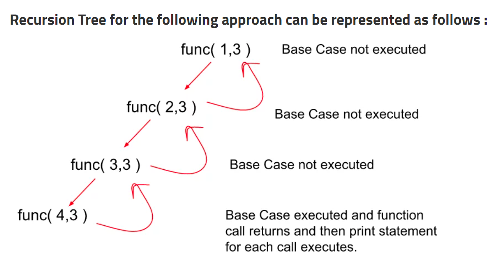

# Print N to 1

---

- ### Approach 1

```C++
#include<bits/stdc++.h>
using namespace std;

void func(int i, int n){

   // Base Condition.
   if(i<1) return;
   cout<<i<<endl;

   // Function call to print i till i decrements to 1.
   func(i-1,n);

}

int main(){

  // Here, let’s take the value of n to be 4.
  int n = 4;
  func(n,n);
  return 0;

}
/*
Output

4
3
2
1
*/
```

### _Time Complexity:_

- Time Complexity: O(N)
- Function N time called.

### _Space Complexity:_

- Space Complexity: O(N)
- In the worst case, the recursion stack space would be full with all the function calls waiting to get completed and that would make it an O(N) recursion stack space

### _Recursion Tree:_


- ### Approach2:

```C++
#include<bits/stdc++.h>
using namespace std;

void func(int i, int n){

   // Base Condition.
   if(i>n) return;

   // Function call to print (i+1) integers.
   func(i+1,n);
   cout<<i<<endl;

}

int main(){

  // Here, let’s take the value of n to be 4.
  int n = 4;
  func(1,n);
  return 0;

}
/*
Output

4
3
2
1
*/
```

- **Time and space complexity** will be the same.

#### Recursion Tree



# Print 1 to N

---

- EASY ONE.
