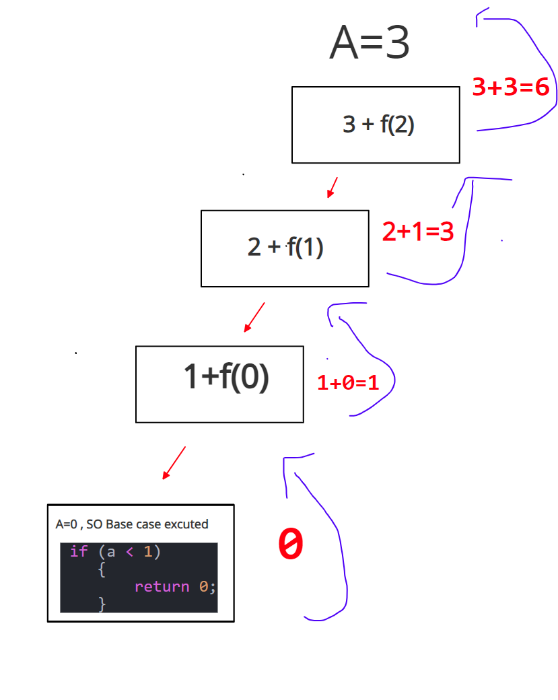

# Sum of N numbers
`Same type problem is N Factorial`  

---

- 2 Approaches:

  - Parameterized
  - Functional

- ### Parameterized:

```C++
#include <iostream>
#include <bits/stdc++.h>
using namespace std;
#define fast()                    \
    ios_base::sync_with_stdio(0); \
    cin.tie(0);                   \
    cout.tie(0);
#define ll long long int
using vi = vector<int>;
using vll = vector<ll>;
#define pb push_back;
#define fo(i, a, b) for (ll i = (a); i < (b); i++)
#define w(x)  \
    ll x;     \
    cin >> x; \
    while (x--)

#define b() begin()
#define e() end()
#define cY cout << "YES\n"
#define cN cout << "NO\n"
#define cy cout << "Yes\n"
#define cn cout << "No\n"

void func(ll a, ll sum)
{
    if (a < 1)
    {
        cout << sum << endl;
        return;
    }
    func(a-1,sum+a);

}
int main()
{
    ll a;
    cin >> a;
    func(a, 0);
    return 0;
}
```

- **Recursion Tree:**
  

- ## Functional:
  - if N given, General form will be **N + f(N-1);**  
    `Here f(N-1) means sum of 1 to N-1`
  - If N = 4,
    - 4 + f(3) `Here f(3) function will return the sum of 1 to 3`

```C++
#include <iostream>
#include <bits/stdc++.h>
using namespace std;
#define fast()                    \
    ios_base::sync_with_stdio(0); \
    cin.tie(0);                   \
    cout.tie(0);
#define ll long long int
using vi = vector<int>;
using vll = vector<ll>;
#define pb push_back;
#define fo(i, a, b) for (ll i = (a); i < (b); i++)
#define w(x)  \
    ll x;     \
    cin >> x; \
    while (x--)

#define b() begin()
#define e() end()
#define cY cout << "YES\n"
#define cN cout << "NO\n"
#define cy cout << "Yes\n"
#define cn cout << "No\n"

ll func(ll a)
{
    if (a < 1)
    {
        return 0;
    }
    return a+func(a-1);

}
int main()
{
    ll a;
    cin >> a;
    cout<<func(a);
    return 0;
}
```

- ### Recursion Tree:



## Time and space complexity are same O(N).
