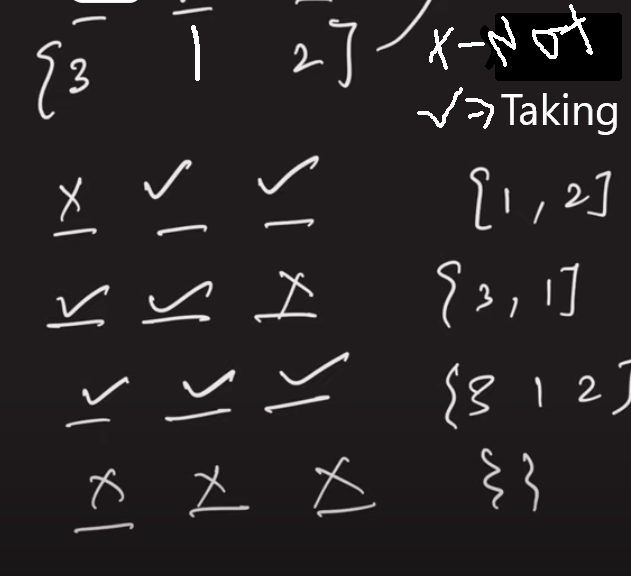
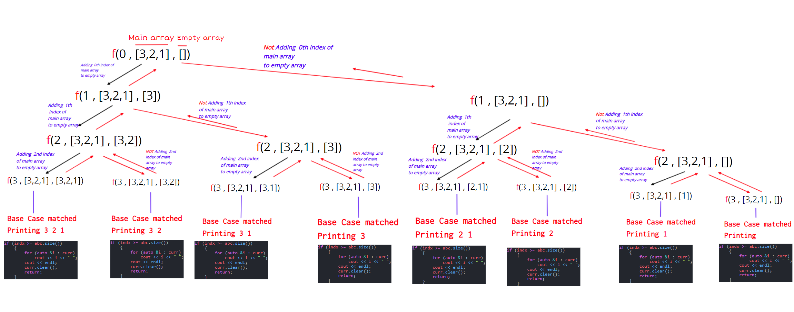

# Subsequence Using recursion:

- `What is subsequence?`
  - A subsequence is a sequence that can be derived from another sequence by removing zero or more elements, without changing the order of the remaining elements.
  - **[1, 2, 3, 4] has 15 subsequence:**
    - (1), (2), (3), (4), (1,2), (1,3),(1,4), (2,3), (2,4), (3,4), (1,2,3), (1,2,4), (1,3,4), (2,3,4), (1,2,3,4).
- `What is Subarray / Substring?`
  - A subarray is a contiguous part of array.
  - An array that is inside another array.
  - `[1, 2, 3, 4]`, There are 10 non-empty sub-arrays. (1), (2), (3), (4), (1,2), (2,3), (3,4), (1,2,3), (2,3,4) and (1,2,3,4)

## How will we find the subsequences using recursion?

- we will using `taking` and `not_taking` approach.

  - 

```C++
#include <iostream>
#include <bits/stdc++.h>
using namespace std;
#define fast()                    \
    ios_base::sync_with_stdio(0); \
    cin.tie(0);                   \
    cout.tie(0);
#define ll long long int
using vi = vector<int>;
using vll = vector<ll>;
#define pb push_back;
#define fo(i, a, b) for (ll i = (a); i < (b); i++)
#define w(x)  \
    ll x;     \
    cin >> x; \
    while (x--)

#define b() begin()
#define e() end()
#define cY cout << "YES\n"
#define cN cout << "NO\n"
#define cy cout << "Yes\n"
#define cn cout << "No\n"
void subsequence(ll indx, vector<int> abc, vector<int> curr)
{
    if (indx >= abc.size())
    {

        for (auto &i : curr)
            cout << i << " ";
        
        if(curr.size()==0) cout <<"{ }";
        cout << endl;
        curr.clear();
        return;
    }
    // Taking
    curr.push_back(abc[indx]);
    subsequence(indx + 1, abc, curr);
    // Not Taking
    curr.pop_back();
    subsequence(indx + 1, abc, curr);
}

int main()
{
    ll a;
    cin >> a;
    vector<int> cd(a);
    for (int i = 0; i < a; i++)
        cin >> cd[i];

    vector<int> curr;
    subsequence(0, cd, curr);
    return 0;
}
```

## Recursion Tree

- 

## Time and space complexity:
- Time complexity =`O((2^n)*n) -> n is for the printing the current array`
- Space complexity = `O(n)`