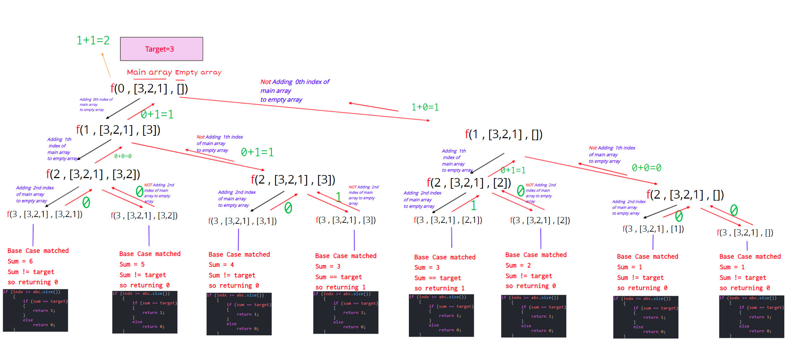

# Index
1. Print all subsequence which sums to Target

    - Normal parameter way
2. Print only 1st subsequence which sums to K
    - Return true or false
    3. Print the count of subsequence which sums to K
    - Return 1 or 0


# Print all the subsequence whose sum is equal to target

- Same logic like finding subsequence.

- Shodho oy subsequence golo print korbo jegolor sum target ke match kore.

```C++
#include <iostream>
#include <bits/stdc++.h>
using namespace std;
#define fast()                    \
    ios_base::sync_with_stdio(0); \
    cin.tie(0);                   \
    cout.tie(0);
#define ll long long int
using vi = vector<int>;
using vll = vector<ll>;
#define pb push_back;
#define fo(i, a, b) for (ll i = (a); i < (b); i++)
#define w(x)  \
    ll x;     \
    cin >> x; \
    while (x--)

#define b() begin()
#define e() end()
#define cY cout << "YES\n"
#define cN cout << "NO\n"
#define cy cout << "Yes\n"
#define cn cout << "No\n"


// Approach 1

void sum_subsequence(ll indx, vector<int> abc, vector<int> curr, ll target)
{
    if (indx >= abc.size())
    {
        ll sum = 0;
        for (auto &i : curr)
            sum += i;


        if (sum == target)
        {
            for (auto &i : curr)
                cout << i << " ";

            cout << endl;
        }

        curr.clear();
        return;
    }
    // Taking
    curr.push_back(abc[indx]);
    sum_subsequence(indx + 1, abc, curr, target);
    // Not Taking
    curr.pop_back();
    sum_subsequence(indx + 1, abc, curr, target);
}

//Approach 2

void sum_subsequence2(ll indx, vector<int> abc, vector<int> curr, ll sum, ll target)
{
    if (indx >= abc.size())
    {


        if (sum == target)
        {
            for (auto &i : curr)
                cout << i << " ";

             cout << endl;
        }

        curr.clear();
        return;
    }

    // Taking

    curr.push_back(abc[indx]);
    sum+=abc[indx];
    sum_subsequence2(indx + 1, abc, curr, sum, target);

    // Not Taking

    sum-=abc[indx];
    curr.pop_back();
    sum_subsequence2(indx + 1, abc, curr, sum, target);
}

int main()
{
    ll a;
    cin >> a;
    vector<int> cd(a);
    for (int i = 0; i < a; i++)
        cin >> cd[i];

    vector<int> curr;
    ll target = 3;
    sum_subsequence(0, cd, curr, target);
    sum_subsequence2(0, cd, curr, 0, target);
    return 0;
}
```

## Print Only one subsequence whose sum is equal to target

- We will use true and false method for stop generating all subsequence.

```C++
#include <iostream>
#include <bits/stdc++.h>
using namespace std;
#define fast()                    \
    ios_base::sync_with_stdio(0); \
    cin.tie(0);                   \
    cout.tie(0);
#define ll long long int
using vi = vector<int>;
using vll = vector<ll>;
#define pb push_back;
#define fo(i, a, b) for (ll i = (a); i < (b); i++)
#define w(x)  \
    ll x;     \
    cin >> x; \
    while (x--)

#define b() begin()
#define e() end()
#define cY cout << "YES\n"
#define cN cout << "NO\n"
#define cy cout << "Yes\n"
#define cn cout << "No\n"


bool first_sum_subsequence(ll indx, vector<int> abc, vector<int> curr, ll sum, ll target)
{
    if (indx >= abc.size())
    {
        if (sum == target)
        {
            for (auto &i : curr)
                cout << i << " ";

            cout << endl;
            curr.clear();
            return true;
        }
        else return false;

    }
    // Taking
    curr.push_back(abc[indx]);
    sum+=abc[indx];
    if(first_sum_subsequence(indx + 1, abc, curr, sum, target)==true){
        return true;
    };

    // Not Taking
    sum-=abc[indx];
    curr.pop_back();
    if(first_sum_subsequence(indx + 1, abc, curr, sum, target)==true){
        return true;
    }
    else return false;
}

int main()
{
    ll a;
    cin >> a;
    vector<int> cd(a);
    for (int i = 0; i < a; i++)
        cin >> cd[i];

    vector<int> curr;

    ll target = 3;

    if(first_sum_subsequence(0, cd, curr,0, target)==false)cout<<"No subsequence sum matched the target"<<endl;
    return 0;
}
```

## Count total number of subsequence that sum is equal to target

- Will return 1 or 0
- Dont need current vector.

```C++
#include <iostream>
#include <bits/stdc++.h>
using namespace std;
#define fast()                    \
    ios_base::sync_with_stdio(0); \
    cin.tie(0);                   \
    cout.tie(0);
#define ll long long int
using vi = vector<int>;
using vll = vector<ll>;
#define pb push_back;
#define fo(i, a, b) for (ll i = (a); i < (b); i++)
#define w(x)  \
    ll x;     \
    cin >> x; \
    while (x--)

#define b() begin()
#define e() end()
#define cY cout << "YES\n"
#define cN cout << "NO\n"
#define cy cout << "Yes\n"
#define cn cout << "No\n"

ll count_subsequence_Equalto_sum(ll indx, vector<int> abc, vector<int> curr, ll sum, ll target)
{
    if(target<sum) return 0;
    if (indx >= abc.size())
    {
        if (sum == target)
        {
            return 1;
        }
        else
            return 0;
    }
    // Taking

    sum += abc[indx];
    ll cnt1 = count_subsequence_Equalto_sum(indx + 1, abc, curr, sum, target);

    // Not Taking
    sum -= abc[indx];

    ll cnt2 = count_subsequence_Equalto_sum(indx + 1, abc, curr, sum, target);

    return cnt1 + cnt2;
}

int main()
{
    ll a;
    cin >> a;
    vector<int> cd(a);
    for (int i = 0; i < a; i++)
        cin >> cd[i];

    ll target = 3;

    cout << "Total number of Subsequence that sum is equal to target  "
    << target << " is " << count_subsequence_Equalto_sum(0, cd, curr, 0, target) << endl;
    return 0;
}
```

### Recursoin Tree

- 

### Time complexity:
- `0(2^n)`