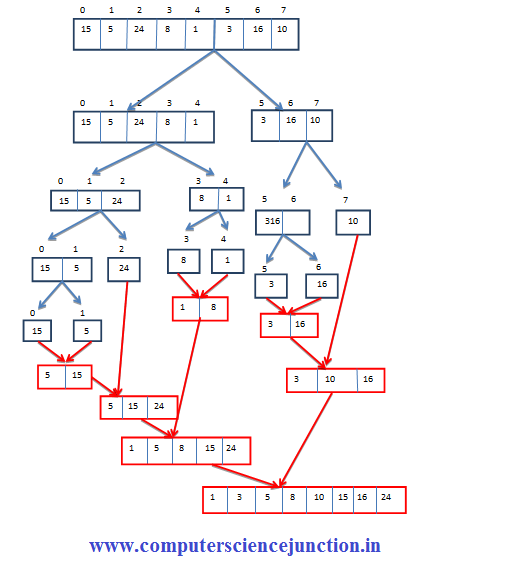

# Merge Sort
---

## Intuition:

- Merge Sort is a divide and conquers algorithm, it divides the given array into equal parts and then merges the 2 sorted parts. 

- `There are 2 main functions :`  

- `merge():` This function is used to merge the 2 halves of the array. It assumes that both parts of the array are sorted and merges both of them.

- `mergeSort():` This function divides the array into 2 parts. 
    - ***low to mid*** 
    - ***mid+1 to high***, where
        - low = leftmost index of the array
        - high = rightmost index of the array
        - mid = Middle index of the array

- We will `recursively split the array`, and go from top-down until all sub-arrays size becomes 1.

## Recursion Tree:

- 


## Code

```C++
#include <bits/stdc++.h>
using namespace std;

void merge(vector<int> &arr, int low, int mid, int high) {
    vector<int> temp; // temporary array
    int left = low;      // starting index of left half of arr
    int right = mid + 1;   // starting index of right half of arr

    //storing elements in the temporary array in a sorted manner//

    while (left <= mid && right <= high) {
        if (arr[left] <= arr[right]) {
            temp.push_back(arr[left]);
            left++;
        }
        else {
            temp.push_back(arr[right]);
            right++;
        }
    }

    // if elements on the left half are still left //

    while (left <= mid) {
        temp.push_back(arr[left]);
        left++;
    }

    //  if elements on the right half are still left //
    while (right <= high) {
        temp.push_back(arr[right]);
        right++;
    }

    // transfering all elements from temporary to arr //
    for (int i = low; i <= high; i++) {
        arr[i] = temp[i - low];
    }
}

void mergeSort(vector<int> &arr, int low, int high) {
    if (low >= high) return;
    int mid = (low + high) / 2 ;
    mergeSort(arr, low, mid);  // left half
    mergeSort(arr, mid + 1, high); // right half
    merge(arr, low, mid, high);  // merging sorted halves
}

int main() {

    vector<int> arr = {9, 4, 7, 6, 3, 1, 5}  ;
    int n = 7;

    cout << "Before Sorting Array: " << endl;
    for (int i = 0; i < n; i++) {
        cout << arr[i] << " "  ;
    }
    cout << endl;
    mergeSort(arr, 0, n - 1);
    cout << "After Sorting Array: " << endl;
    for (int i = 0; i < n; i++) {
        cout << arr[i] << " "  ;
    }
    cout << endl;
    return 0 ;
}
```

## Time Complexity:

-  O(nlogn) 
- At each step, we divide the whole array, `for that logn` and we assume n steps are taken to get sorted array, so overall time complexity will be nlogn

- if size of array , N = 8,
    - array will be divided into `8-> 4 -> 2 -> 1`
    - Total level = 3
    - 2^3 = 8
    - log(2)8 = 3
    - log(2)N = 3
## Space Complexity: 

- O(n)  
- We are using a temporary array to store elements in sorted order.
