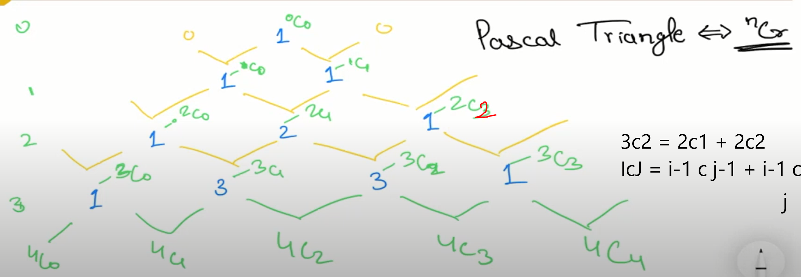

# problem Link: https://leetcode.com/problems/pascals-triangle/



- Time complexity : O(Row*Row)

```C++

class Solution
{
public:
    vector<vector<int>> generate(int numRows)
    {
        vector<vector<int>> abc(numRows);
        for (int i = 0; i < numRows; i++)
        {

            abc[i].resize(i + 1);
            abc[i][0] = 1;
            abc[i][i] = 1;
            for (int j = 1; j < i; j++)
            {
                abc[i][j] = abc[i - 1][j - 1] + abc[i - 1][j];
            }
        }
        return abc;
    }
};
```